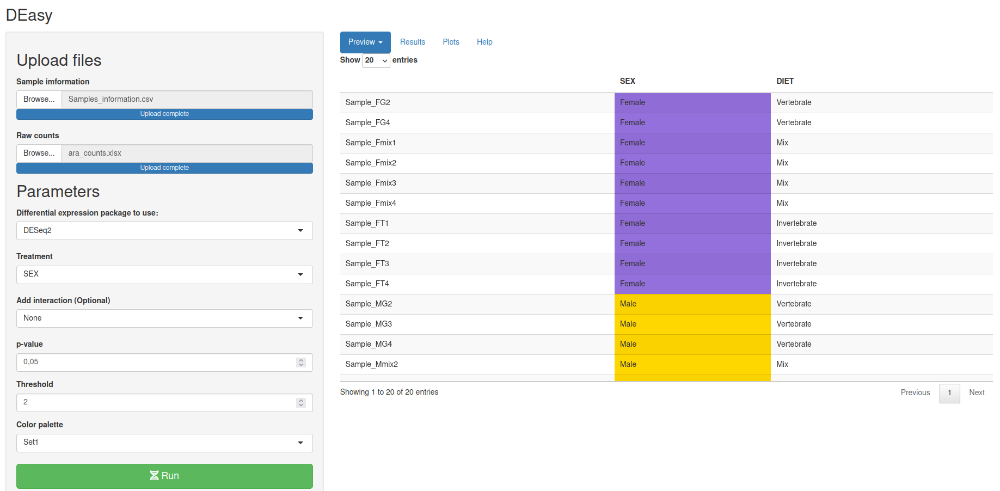
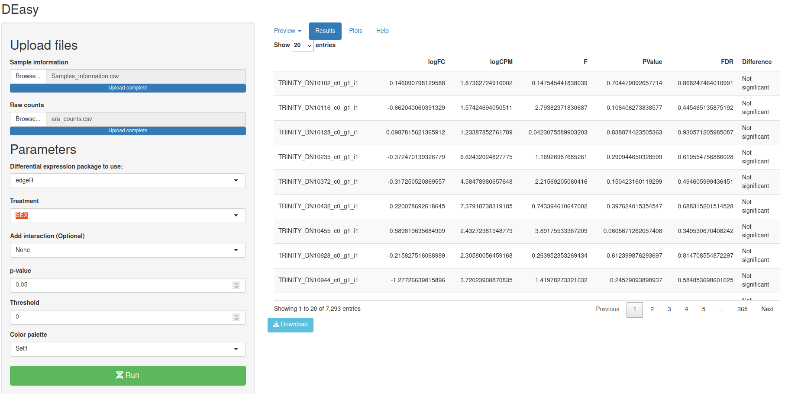

```{r setup, include=FALSE}
knitr::opts_chunk$set(echo = TRUE)
```

## DEasy!

This is a shiny app created to make Differential gene expression (DGE) analyses easier, With DEasy is possible make DGE analysis from raw counts using `DESeq2` or `edgeR`, those are the most used and better documented packages to perform DGE analyses.

## How to use it?

### Using R

If you want to run ~DEasy~ directly on you computer you can downland it from github

```{r eval=FALSE}
library(devtools)
install_github("diego-sierra-r/DEasy")
```

Then you can use this shinyapp/package in a R session: - TODO imagen \####

### Using a Web browser

You can access to DEasy using web browser for free, this is useful if you want to use the app without using R, but essentially the performance its the same. in any case, firts you have prepare the data:

To make a dirential gene expresion analisis is requieresd having a set of samples and two grups to compare. This is the **Sample information file**. Take on mind the next advices:

-   DEasy can take .xslx, .csv and . tsv files

```{=html}
<!-- -->
```
-   The first column have to contain all your samples

-   All columns must have the same length.

-   The second and third (optional) columns must contain the groups that are going to be compared.

-   The column names should not start with symbols

The next table shows an example where the 20 samples belong to two main groups according to their biological sex:


The second table required to perform differential expression analysis is the **Raw counts file** a database with all the transcripts of genes that where found on each one of the samples, take on mind these advises:

-   DEasy can take .xslx, .csv and . tsv files

-   The first column must contain all the gene or transcript names

-   The number of samples must be equal to the number of samples on your **Sample information file**

-   The counts must the raw counts, DEasy use specific normalizing method according to the package chosen internally.

-   All columns must have the same length.

## Explicar la Normalizacion interna que hacen los paquetes 


 


 

 
