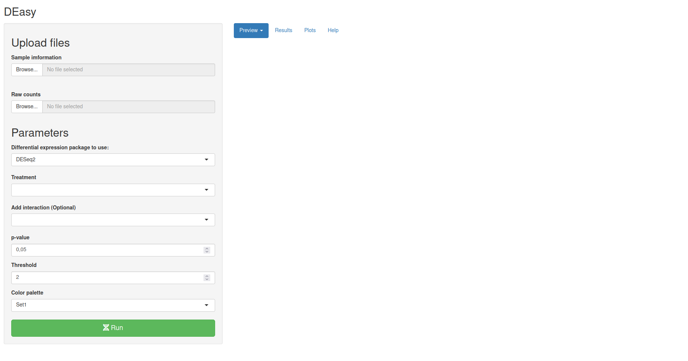
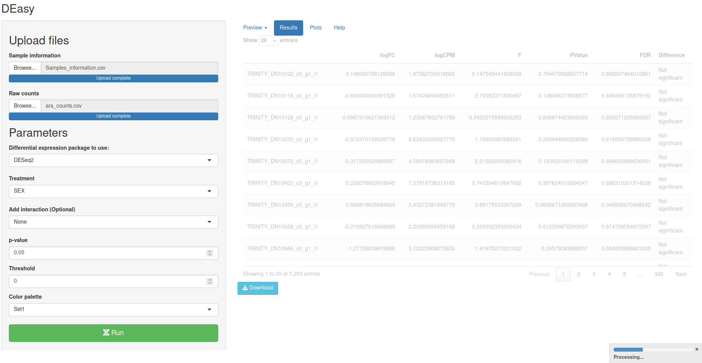
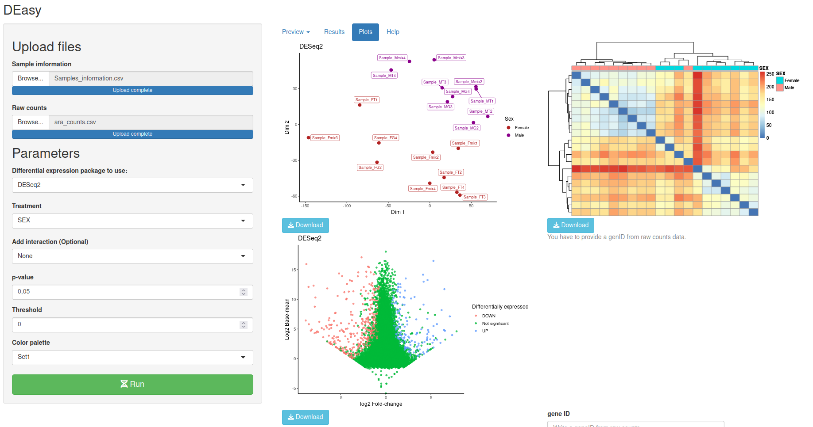

```{r setup, include=FALSE}
knitr::opts_chunk$set(echo = TRUE)
```

## DEasy!

`DEasy` is a shiny app created to make Differential gene expression (DGE) analyses easier, with `DEasy` is possible make DGE analysis from raw counts using `DESeq2` or `edgeR`, those are the most used and better documented packages to perform DGE analyses.

## How to use it?

One of the advantages of DEasy is the you can run DE analyses without prior knowledge programming or without solid R bases, you just need internet connection and clicking on: [DEasy!](https://posfer585.shinyapps.io/DEasy/)

#### Preparing the data

You can access to ~DEasy~ using web browser for free, this is useful if you want to use the app without using R, There are not major differences, essentially the performance its the same. in any case, first you have prepare the data:

To make a differential gene expression analysis is required having a set of samples and two groups to compare. This is the **Sample information file**. Take on mind the next advice:

-   ~DEasy~ can take .xslx or .csv files

<!-- -->

-   The first column have to contain all your samples

-   All columns must have the same length.

-   The second and third (optional) columns must contain the groups that are going to be compared.

-   The column names should not start with symbols

The next table shows an example where the 20 samples belong to two main groups according to their biological sex:


The second table required to perform differential expression analysis is the **Raw counts file,** a table with all the transcripts or genes that where found on each one of the samples, take on mind these advises:

-   DEasy can take .xslx or .csv files

-   The first column must contain all the gene or transcript names

-   The number of samples must be equal to the number of samples on your **Sample information file**

-   The ID related to each of the samples must be the same between **Sample information** file and the **Raw counts file**

-   The counts must be raw counts, ~DEasy~ use specific normalizing method according to the package chosen internally (`DEseq2` or `edgeR`).

-   All columns must have the same length.

The next table show the head of a **Raw counts file**


You can get the example data and try yourself here: [data example](https://github.com/diego-sierra-r/DEasy/tree/main/tests)

DESeq2 performs an internal normalization procedure using the geometric mean, which is calculated for each gene across all samples. The counts for a gene in each sample is then divided by this mean: see more [Documentation](http://bioconductor.org/packages/devel/bioc/vignettes/DESeq2/inst/doc/DESeq2.html#why-un-normalized-counts) for DESeq2, on the other hand, edgeR use TMM method to compute normalization factors that represent sample-specific biases considering library size: see more [Documentation](https://bioconductor.org/packages/release/bioc/vignettes/edgeR/inst/doc/edgeRUsersGuide.pdf).

#### The panels

\~DEasy\~ have sidebar panel where you can upload the **Raw counts file** and **Sample information file**. you can upload just *.xlsx* or *.csv* files. This app can deal with files with a maximum size of 500MB.

 Once you provide the file with the correct format you can review your data on the preview tab panel, by default \~DEasy\~ take the second column as the group (Treatments) that are going to be compared.


The next section are the parameters, you can select `DESeq2` or `edge2`, to performance the analysis, if you have a second group on your sample information file and you want to test the interaction between treatment, for example \~SEX + DIET you can select "Add interaction", by default ~DEasy~ chose "none" interaction, in other words It just considerate the the first treatment.


Then you can set an alfa value (0.05 p-value by default) and a threshold where you con, once you have defined the parameters you have to clink on the **Run** button and go the **Results** tab to watch the results, this process usually take some minutes so you have time to go for a coffee. Once the results main table is ready you can explore the pages and look for significance difference on each transcript, or you can download the table and use other tools like Microsoft Excel to explore the data.

Note: Shinny is a lazy web framework, so you have to click the **Results** panel after click on the **Run button** to start processing de data.


A progressing bar should appear indicating the progress.



The last component on this app is the **Plot** tab section, the first plot its a Multidimentional scaling plot

The second plot its a heatmap, that shows you how similar some samples according their differential gene expression, The clusting method behind this heatmap is Ward.d2 to find compact and spherical clusters.

The third plot it's a MA-plot where you can visualize how much differentially expressed are your genes between your treatments, and their proportion again the number of genes who are not considered differentialy expressed.



Once you have found an interesting gene or transcript you can use the last tool on the left bottom corner to generate a basic plot where you can visualize differences on a specific gene.


That's how `DEasy` can help you to explore and analyze data from Differential gene expression experiments, if you want more information you can check the GitHub repository here: [DEasy GitHub](https://github.com/diego-sierra-r/DEasy), also you can run this example using data from *tests* folder on GitHub. 

I hope you can find `DEasy` useful.

