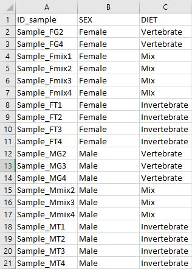

---
---

```{r setup, include=FALSE}
knitr::opts_chunk$set(echo = TRUE)
```


## DEasy!

This is a shiny app created to make Differential gene expression (DGE) analyses easier, With DEasy is possible make DGE analysis from raw counts using `DESeq2` or `edgeR`, those are the most used and better documented packages to perform DGE analyses.

## How to use it?

### Using R

If you want to run ~DEasy~ directly on you computer you can downland it from github

```{r eval=FALSE}
library(devtools)
install_github("diego-sierra-r/DEasy")
```

Then you can use this shinyapp/package in a R session:
- TODO  imagen ####

### Using a Web browser



...


