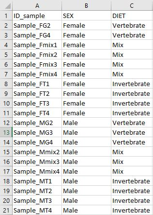
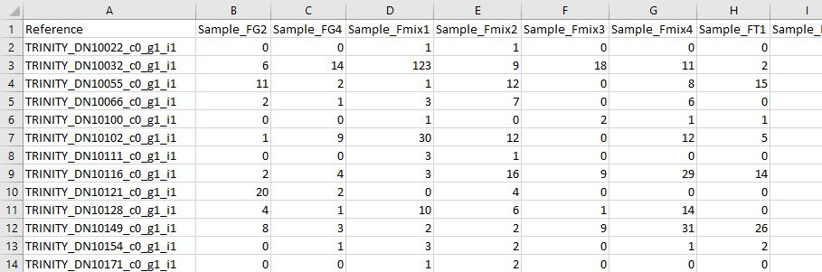
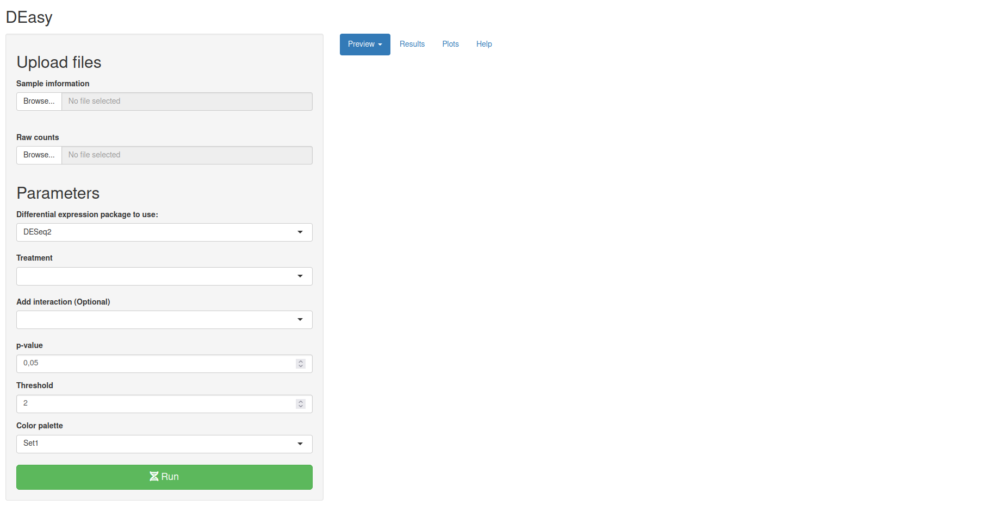
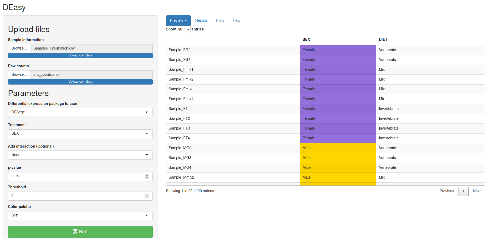
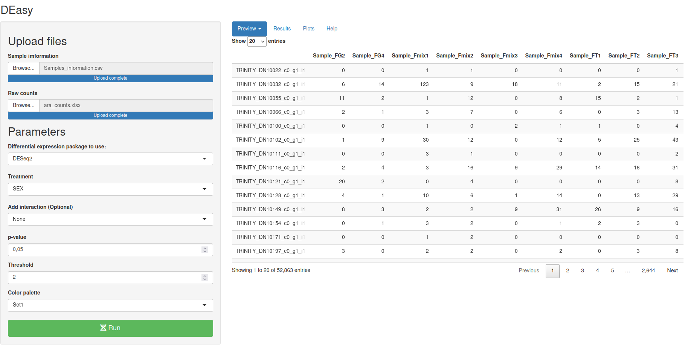
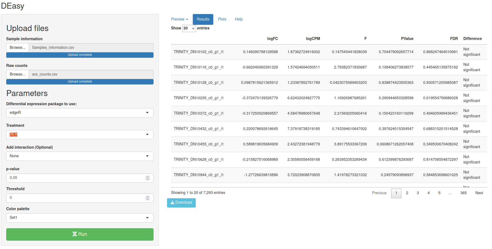
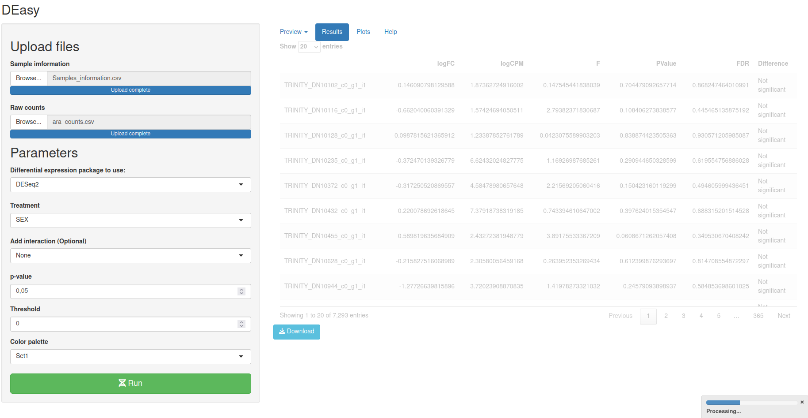
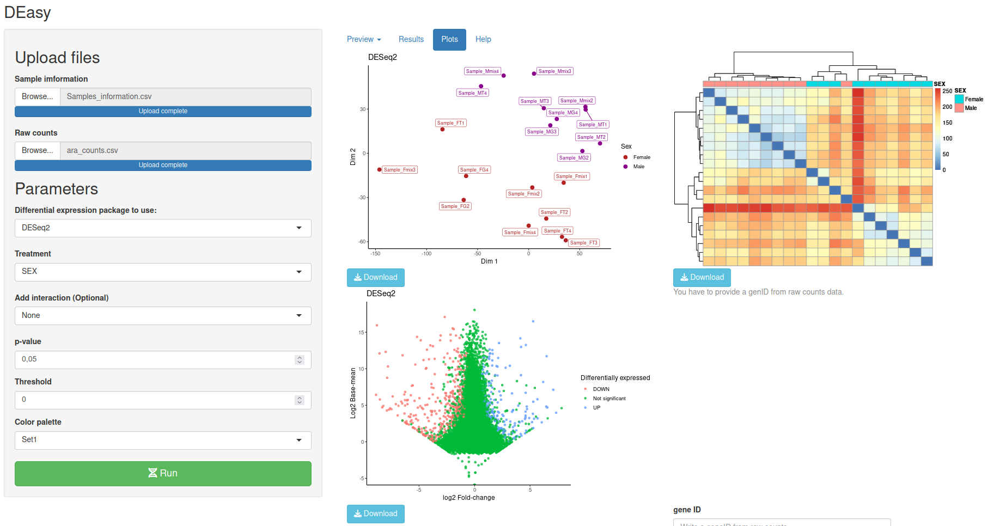
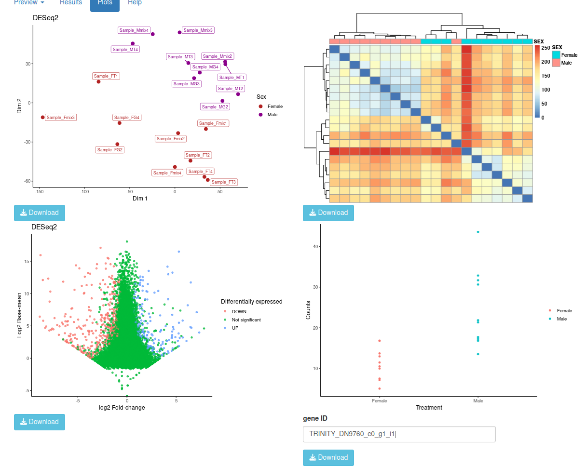

------------------------------------------------------------------------

## DEasy!

This is a shiny app created to make Differential gene expression (DGE)
analyses easier, With DEasy is possible make DGE analysis from raw
counts using `DESeq2` or `edgeR`, those are the most used and better
documented packages to perform DGE analyses.

## How to use it?

### Using R

If you want to run <sub>DEasy</sub> directly on you computer you can
download it from github

``` r
library(devtools)
install_github("diego-sierra-r/DEasy")
```

Then you can use this shinyapp/package in a R session: - TODO image
\####

### Using a Web browser

#### Preparing the data

You can access to <sub>DEasy</sub> using web browser for free, this is
useful if you want to use the app without using R, but essentially the
performance its the same. in any case, first you have prepare the data:

To make a differential gene expression analysis is required having a set
of samples and two groups to compare. This is the **Sample information
file**. Take on mind the next advice:

- <sub>DEasy</sub> can take .xslx, .csv and . tsv files

<!-- -->

- The first column have to contain all your samples

- All columns must have the same length.

- The second and third (optional) columns must contain the groups that
  are going to be compared.

- The column names should not start with symbols

The next table shows an example where the 20 samples belong to two main
groups according to their biological sex:



The second table required to perform differential expression analysis is
the **Raw counts file** a database with all the transcripts of genes
that where found on each one of the samples, take on mind these advises:

- DEasy can take .xslx, .csv and . tsv files

- The first column must contain all the gene or transcript names

- The number of samples must be equal to the number of samples on your
  **Sample information file**

- The ID related to each of the samples must be the same between
  **Sample information** file and this **Raw counts file**

- The counts must the raw counts, <sub>DEasy</sub> use specific
  normalizing method according to the package chosen internally
  (`DEseq2` or `edgeR` ).

- All columns must have the same length.

The next table show the head of a **Raw counts file**



#### The panels

\~DEasy\~ have sidebar panel where you can upload the **Raw counts
file** and **Sample information file**. you can upload just *xlsx, tsv*
or *csv* files. This app can deal with files with a maximum size of
500MB.

 Once you provide the file with the correct format
you can review your data on the preview tab panel, by default \~DEasy\~
take the second column as the group (Treatments) that are going to be
compared.



The next section are the parameters, you can select `DESeq2` or `edge2`,
to performance the analysis, if you have a second group on your sample
information file you want to test the interaction between treatment, for
example \~SEX + DIET you can select add that interaction, by default
<sub>Deasy</sub> chose “none” interaction, in other words It just
considerate the the first treatment.

## Explicar la Normalizacion interna que hacen los paquetes



Then you can set an alfa value (p-value) to … and a threshold…, once you
have defined the parameters you have to clink on the **Run** button and
go the **Results** tab to watch the results, this process usually take
some minutes so you have time to go for a coffee. ones the the results
main table is ready you can explore the pages. and look for significance
difference on each transcript, or you can download the table and use
other tools like Microsoft Excel to explore the data.



A progressing bar should appear indicating the progress.



The last component on this app is the **Plot** tab section, the first
plot its a Multidimentional scaling plot …

The second plot its a heatmap (UPGMA?…) that shows you how similar some
samples according their differential gene expression.

The third plot it’s a MA-plot where you can visualizar how much
differential gen expressed genes are between your treatments, and their
proportion agains the number of genes who are not considered
differentialy expressed.



Once you have found an interesting gene or transcript you can use the
last tool on the left bottom corner to generate a basic plot where you
can can vizualize differences on a specific gene.



That’s how `DEasy` can help you to explore and analyze datafrom
Differential gene expression experiments, I hope you can find it useful
😀.
